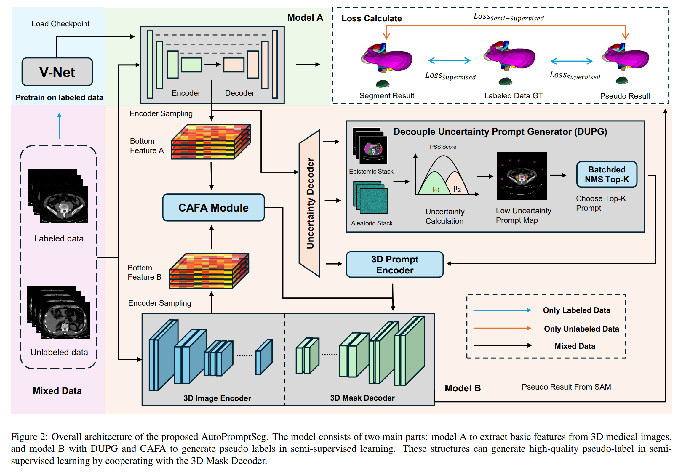
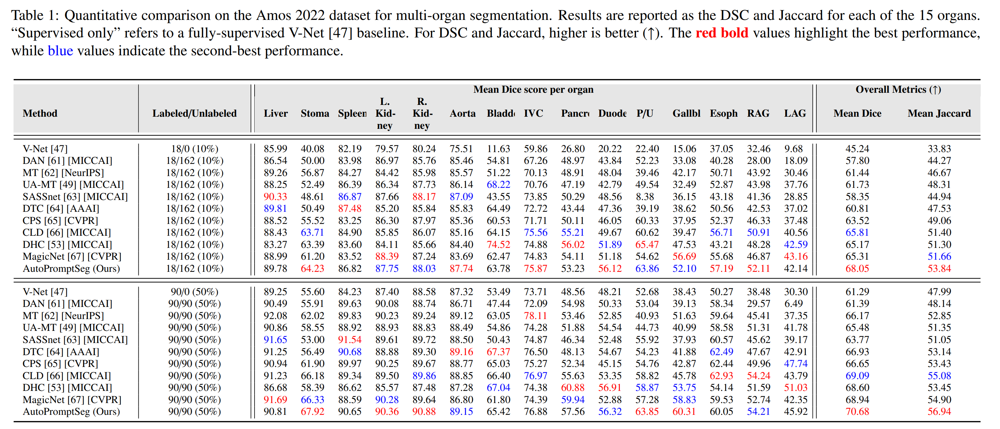
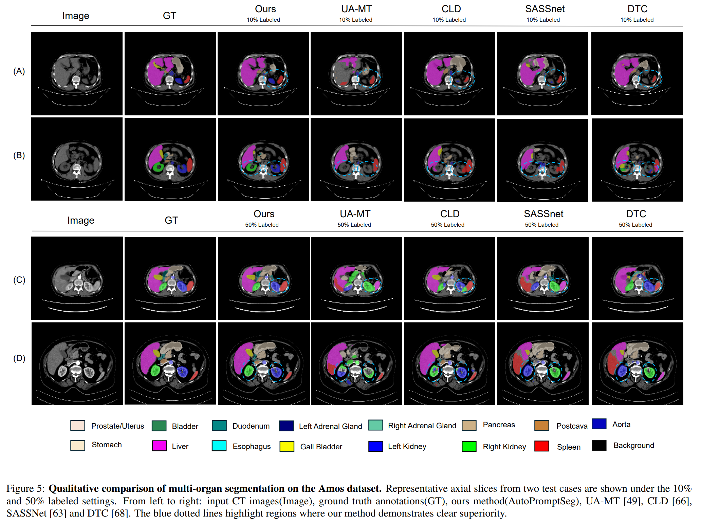
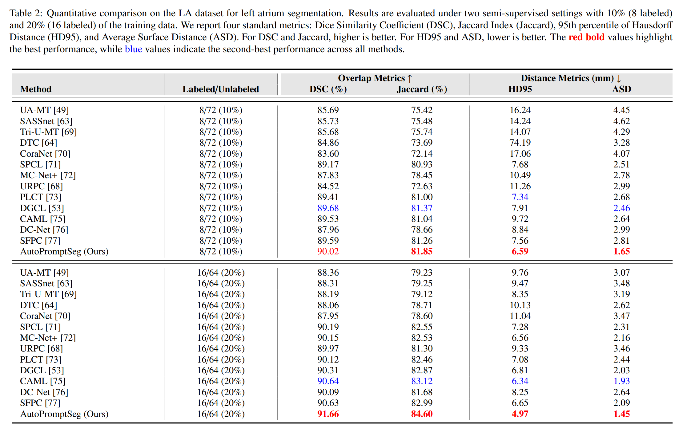
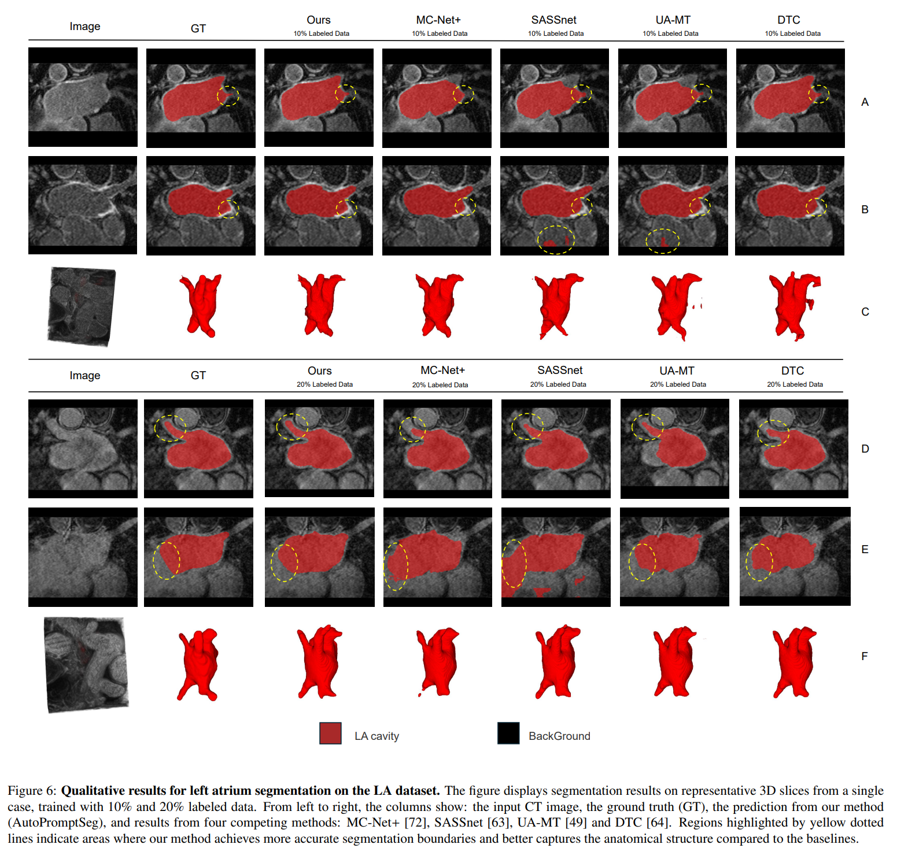
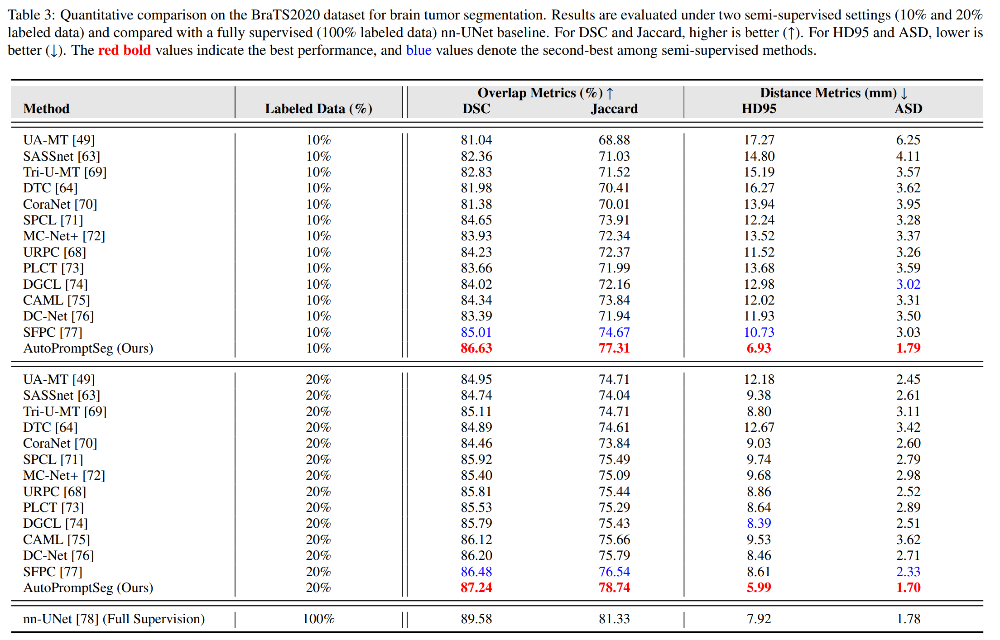

# AutoPromptSeg: Auto Decouple Uncertainty Prompt with SAM by Semi-supervised Learning in 3D Medical Image Segmentation

Accurate segmentation is crucial in computer-aided diagnosis, surgical navigation, and radiotherapy. 
The scarcity high-quality data limits the application of supervised learning in these area.  
This repository provides the official implementation of **AutoPromptSeg**, a high-performance deep learning framework build on SAM for semi-supervised medical image segmentation.

**Attention**: this repository is still building and maybe miss some files, we will upload more essential file in future.

## 🔥 Highlights

* **SAM based model**: By the outstanding performance of segmentation on nature images, we builds upon a modified SAM architecture that operates natively on 3D volumetric data in medical images.
* **Uncertainty evaluation prompt module**: We developed a novel prompts generator called Decoupled Unvertainty Prompt Generator(DUPG) while maintaining superior segmentation performance in data-scarce scenarios. This generator use decouple uncertainty(Data Uncertainty and Model Uncertainty) to evaluation the uncertainty in picture and choose Top-K prompt certainty for SAM.
* **Effectively fuse module**: We propose a module called Channel Alignment and Fusion Architecture(CAFA) to align features obtained from different branches, thereby bolstering the representational capacity of unlabeled data.
* **Extensive Validation**: Evaluated on **Amos 2022**, **LA** and **BraTS 2020**datasets under different labeled data settings.

## 📊 Main Results

* On **Amos 2022** dataset:

* On **LA** dataset:

* On **BraTS 2020** dataset:

## 📜 License

This project is released under the [GPL3 License](LICENSE).